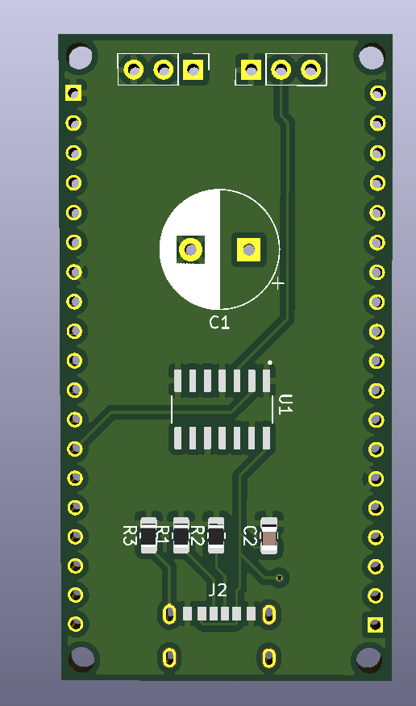

# LED Adapter circuit for the ESP32 Dev Kit C V4 NodeMCU

 


This project is circuit for the esp32 NodeMCU microcontroller to give the possibility to easily add an addressable led strip, like the ws2812b or the sk6812. The circuit will be powered via a USB-C connector and can be plugged onto the ESP32.

## How does it work?

The esp32 is connected to the power supply of the circuit and the addressable pin for the strip. The signal will then be level-shifted from 3.3V to 5V. On the top of the circuit is the connection for the 3-pin connector to plug in your strip.

## How to use

### Editing

This project was created with KiCad 5.1. If you wish to edit the schematic or footprint install KiCad and clone this repository.
```bash 
git clone https://github.com/felix0351z/esp32-led
```

After that you need to import the necessary footprints which kicad doesn't ship automatically.
I used 3 external footprints for the [USB-Connector](https://www.snapeda.com/parts/USB4125-GF-A/Global%20Connector%20Technology/view-part/), 
the [ESP32 NodeMCU](https://www.snapeda.com/parts/ESP32-DEVKITC-32D/Espressif%20Systems/view-part/) board and the [level shifter](https://www.snapeda.com/parts/SN74AHCT125D/Texas%20Instruments/view-part/).

You can download the footprints on SnapEDA and import them to KiCad. If you have other pcb parts at home, you can change them of course.

### Ordering 

If you want to order a pcb you can select a manufacturer of your choice. I used [JLCPCB](https://jlcpcb.com/) for this. Upload the gerber files and go!
